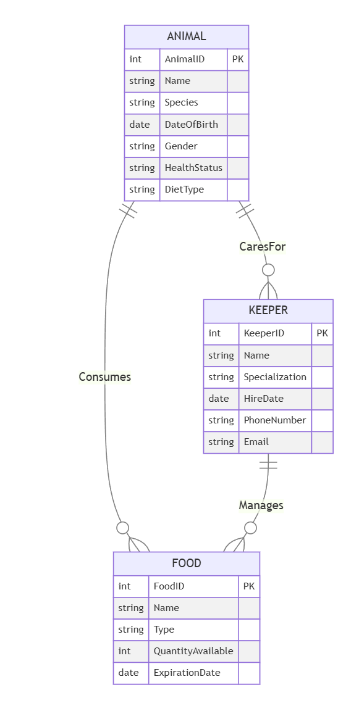

# ER diagram design for a model of a zoo

## 1. Definition of entities ##

### Animal ###
- attributes：

            AnimalID (Primary Key): Unique identifier for the animal.
            Name: Name of the animal.
            Species: Species of the animal (e.g., lion, elephant).
            DateOfBirth: Date of birth of the animal.
            Gender: Gender of the animal (e.g., male, female).
            HealthStatus: Health status of the animal (e.g., healthy, sick, recovering).
            DietType: Type of diet the animal follows (e.g., carnivore, herbivore, omnivore).
- limit to：
  
            AnimalID: Must be unique.  
            Species: Cannot be null.
            DietType must be specified and match the species' natural diet.

### Keeper ###
- attributes：

            KeeperID (Primary Key): Unique identifier for the keeper.
            Name: Name of the keeper.
            Specialization: Keeper's area of expertise (e.g., mammals, birds, reptiles).
            HireDate: Date the keeper was hired.
            PhoneNumber: Keeper's contact phone number.
            Email: Keeper's email address.

- limit to：

            KeeperID: Must be unique.
            Name: Cannot be null.
            Specialization: Cannot be null.
            Email: Must follow a valid email format.

### Food ###

- attributes：

            FoodID (Primary Key): Unique identifier for the food.
            Name: Name of the food (e.g., meat, hay, fruits).
            Type: Type of food (e.g., protein, fiber, vitamins).
            QuantityAvailable: Quantity of food available in stock.
            ExpirationDate: Expiration date of the food.

- limit to：

            FoodID must be unique.
            Name and Type cannot be null.
            QuantityAvailable must be non-negative.
            ExpirationDate must be in the future when added to the system.

## Relationships ##

### Animal - Keeper: CaresFor
- Description: A keeper can care for multiple animals, and an animal can be cared for by multiple keepers.

- Cardinality: Many-to-Many (M:N ).

- Constraints:
Each animal must have at least one keeper.
A keeper's specialization must match the animal's species (e.g., a mammal keeper can only care for mammals).

### Animal - Food: Consumes
- Description: An animal consumes specific types of food based on its diet, and a type of food can be consumed by multiple animals.

- Cardinality: Many-to-Many (M:N ).

- Constraints:
The food type must match the animal's diet (e.g., a carnivore can only consume meat).
The quantity of food consumed by an animal must not exceed the available quantity in stock.

### Keeper - Food: Manages
- Description: A keeper is responsible for managing the inventory of specific types of food.

- Cardinality: Many-to-Many (M:N ).

- Constraints:
Each food type must be managed by at least one keeper.
A keeper can only manage food types relevant to their specialization (e.g., a reptile keeper can manage food for reptiles).

## 3. ER Diagram Description

Animal - Keeper: CaresFor
Ensures that each animal is cared for by at least one keeper, and tasks are assigned based on the keeper's expertise. For example, a lion (carnivore) must be cared for by a mammal keeper, not a bird keeper.

Animal - Food: Consumes
Ensures that animals receive the correct diet and that food inventory is managed efficiently. For example, an elephant (herbivore) cannot consume meat, and the food stock must meet the needs of all animals.

Keeper - Food: Manages
Ensures that food inventory is managed by keepers with relevant expertise to prevent mismanagement. For example, a reptile keeper is responsible for managing food such as insects or small rodents.

The chosen constraints mirror the real-world operations of a zoo, where animals have species-specific care and diets, and where inventory management and staff specialization are crucial for the smooth running of the zoo. The entity relationships and their constraints ensure that the system enforces rules regarding expertise, food management, and proper animal care. These decisions aim to ensure that the zoo operates efficiently, with animals receiving proper nutrition, care, and attention from qualified staff.